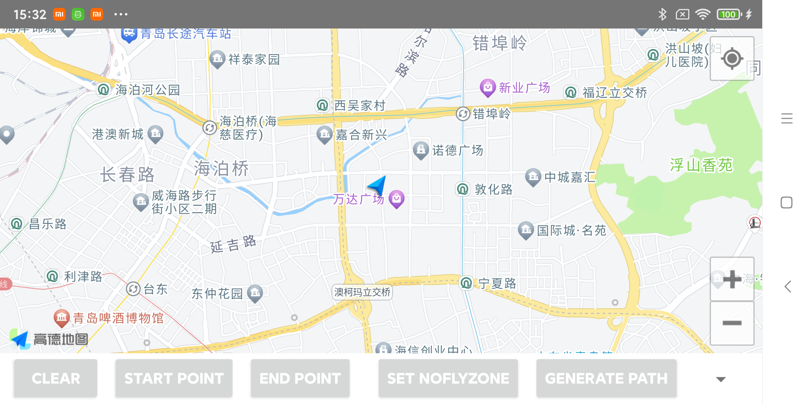
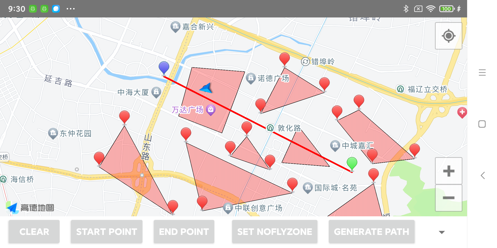
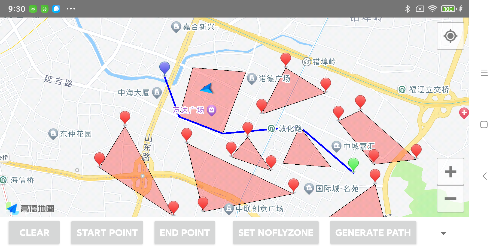

<h1 align="center">✈️ DroneDetour</h1>

<p align="center">
  <b>Making every drone flight safe and intelligent</b><br>
</p>

<p align="center">
  <a href="https://github.com/xumeng367/DroneDetour/stargazers">
    
  </a>
  <a href="https://github.com/xumeng367/DroneDetour/network/members">
    
  </a>
  <a href="https://github.com/xumeng367/DroneDetour/issues">
    
  </a>
  <a href="https://github.com/xumeng367/DroneDetour/blob/main/LICENSE">
    
  </a>
</p>

---

# DroneDetour ✈️
DroneDetour is a Java-based library with an Android demo that implements an intelligent UAV detour path planning algorithm.  
It enables autonomous drones to calculate the shortest safe flight route around multiple polygonal no-fly zones, ensuring reliable navigation even under GPS-degraded or restricted environments.

---

## 🌟 Features
- 🚫 Support for multiple polygonal no-fly zones
- 🧭 Automatic shortest detour route calculation
- ⚙️ Configurable safeBuffer (e.g., 10 meters)
- 📱 Android demo for visualization and testing
- 💡 Pure Java library — easy to integrate into flight control or simulation systems

---

## 🚀 Quick Start

### 🔧 1. Add the library to your Android project
Copy the `lib_detour` module into your project.

### 🧩 2. Initialize and compute a detour path
```java
  List<MyLatLng> noFlyZone = new ArrayList<MyLatLng>();
        noFlyZone.add(.);//no fly zone border point

List<List<MyLatLng>> noFlyZones = new ArrayList<List<MyLatLng>>();
        noFlyZones.add(noFlyZone);
//1. update no fly zones
        DetourPathManager.getsInstance().updateNoFlyZones(noFlyZones);
//2. calculate the shortest detour path 
MyLatLng startPoint = new MyLatLng(36.1234132, 120.333345);
MyLatLng endPoint = new MyLatLng(36.1234132, 120.333345);
//3. get the detour path
List<MyLatLng> detourPath = DetourPathManager.getsInstance().calculateDetourPath(List.of(startPoint, endPoint));
```
---

## 🎯 Drone Detour Demo

### 📱 Screenshot
Default demo screen


Across noFlyZones



Detour path



## 🚀 Future Roadmap
- [ ] Machine Learning-based path optimization

- [ ] Swarm coordination algorithms

- [ ] Real-time weather integration

- [ ] Extended no-fly zone database

---
## 👨‍💻 Author

**Meng Xu(许萌)**  
📧 [xumeng367@gmail.com](mailto:xumeng367@gmail.com)  
💻 [GitHub: xumeng367](https://github.com/xumeng367)

---

## 📜 License

This project is licensed under the **MIT License**.  
You are free to use, modify, and distribute it — but please retain author attribution.

---

## ⭐ Support the Project

If you find DroneDetour useful, please give us a star ⭐ on GitHub! This helps us reach more developers and continue improving the library.

---

<p align="center">
  <b>Made with ❤️ by Meng Xu</b><br>
  <sub>Making every drone flight safe and intelligent.</sub>
</p>
